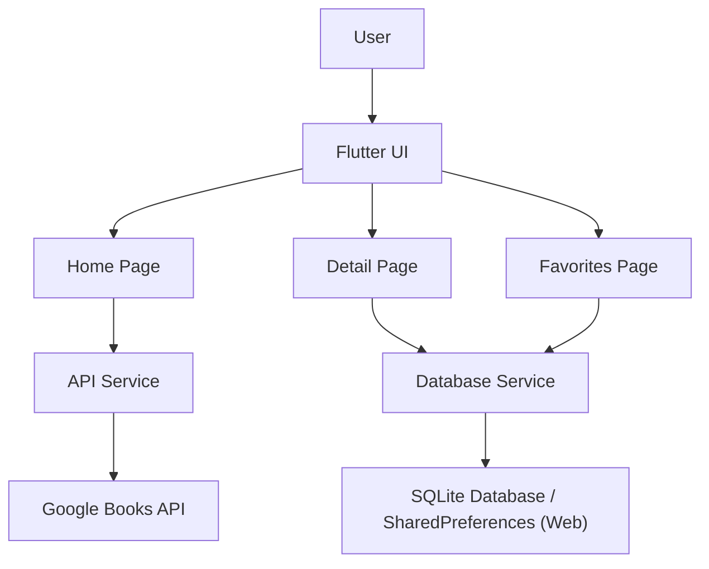
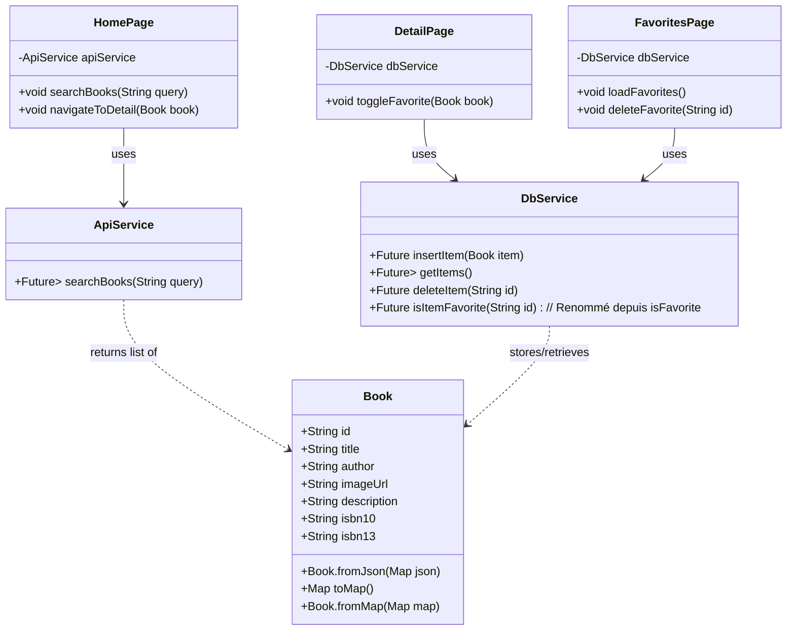

# Livre App - Recherche de Livres et Favoris en Flutter

Ce projet est une application Flutter permettant aux utilisateurs de rechercher des livres via l'API Google Books et d'enregistrer leurs livres préférés localement en utilisant SQLite (ou SharedPreferences pour le web).

## Aperçu du Projet

L'application est structurée en plusieurs composants clés :

- **Modèles (`Models`)**: Définit la structure des données pour un livre.
- **Services (`Services`)**: Gère les appels aux API externes (Google Books) et les interactions avec la base de données locale.
- **Pages (Interface Utilisateur - `UI`)**: Présente les informations à l'utilisateur et gère les interactions utilisateurs.

L'objectif principal est de fournir une interface simple et intuitive pour découvrir des livres et gérer une liste personnelle de favoris.

### Structure du Projet :



### Diagramme de Classe du Projet :



## Composants Clés et Extraits de Code

### 1. Modèle `Book` (`lib/models/book.dart`)

La classe `Book` définit la structure d'un objet livre. Elle inclut des méthodes pour la conversion depuis et vers JSON (pour l'interaction avec l'API) et un Map (pour l'interaction avec la base de données).

```dart
// lib/models/book.dart
class Book {
  final String id;
  final String title;
  final String author;
  final String imageUrl;
  final String description;
  final String isbn10;
  final String isbn13;

  Book({
    required this.id,
    required this.title,
    required this.author,
    required this.imageUrl,
    required this.description,
    this.isbn10 = '',
    this.isbn13 = '',
  });

  // Factory constructor to create a Book object from JSON (API response)
  factory Book.fromJson(Map<String, dynamic> json) {
    // ... (implementation for parsing JSON and handling image URLs)
    final volumeInfo = json['volumeInfo'] ?? {};
    final imageLinks = volumeInfo['imageLinks'] ?? {};
    String imageUrl = ''; // Logic to pick best image URL
    // ...
    return Book(
      id: json['id'] ?? DateTime.now().millisecondsSinceEpoch.toString(),
      title: volumeInfo['title'] ?? 'No Title',
      author: (volumeInfo['authors'] as List?)?.join(', ') ?? 'Unknown Author',
      imageUrl: imageUrl, // Processed image URL
      description: volumeInfo['description'] ?? 'No description available.',
      // ... (isbn parsing)
    );
  }

  // Convert a Book object into a Map object for database operations
  Map<String, dynamic> toMap() {
    return {
      'id': id,
      'title': title,
      'author': author,
      'imageUrl': imageUrl,
      'description': description,
    };
  }

  // Create a Book object from a Map object (database record)
  factory Book.fromMap(Map<String, dynamic> map) {
    return Book(
      id: map['id'] ?? '',
      title: map['title'] ?? 'No Title',
      author: map['author'] ?? 'Unknown Author',
      imageUrl: map['imageUrl'] ?? '',
      description: map['description'] ?? 'No description available.',
      // Note: ISBNs are not stored in the local DB in this example
    );
  }
}
```

### 2. Service API (`lib/services/api_service.dart`)

Le service `ApiService` est responsable de la récupération des données des livres depuis l'API Google Books.

```dart
// lib/services/api_service.dart
import 'dart:convert';
import 'package:http/http.dart' as http;
import '../models/book.dart';
// ...

class ApiService {
  static const String _baseUrl = 'https://www.googleapis.com/books/v1/volumes';
  // ... (headers)

  Future<List<Book>> searchBooks(String query) async {
    final response = await http.get(
      Uri.parse('$_baseUrl?q=$query'),
      // headers: _headers, // Headers might be needed for some APIs
    );

    if (response.statusCode == 200) {
      final Map<String, dynamic> data = json.decode(response.body);
      final List<dynamic> items = data['items'] ?? [];
      return items.map((json) => Book.fromJson(json)).toList();
    } else {
      throw Exception('Failed to load books');
    }
  }
}
```

### 3. Service de Base de Données (`lib/services/db_service.dart`)

Le service `DbService` gère le stockage local des livres favoris. Il utilise `sqflite` pour les plateformes mobiles et `shared_preferences` comme alternative pour le web.

```dart
// lib/services/db_service.dart
import 'package:sqflite/sqflite.dart';
// ... (other imports for path, shared_preferences, kIsWeb)
import '../models/book.dart';

class DbService {
  static Database? _database;
  static const String _tableName = 'favorites';
  // ... (isWeb getter)

  Future<Database> get database async {
    // ... (database initialization for non-web)
  }

  Future<void> _initDatabase() async {
    // ... (SQLite database creation with 'favorites' table)
    // CREATE TABLE $_tableName(
    //   id TEXT PRIMARY KEY,
    //   title TEXT,
    //   author TEXT,
    //   imageUrl TEXT,
    //   description TEXT
    // )
  }

  Future<void> insertItem(Book item) async {
    if (isWeb) {
      await _insertItemWeb(item); // Uses SharedPreferences
    } else {
      final db = await database;
      await db.insert(
        _tableName,
        item.toMap(),
        conflictAlgorithm: ConflictAlgorithm.replace,
      );
    }
  }

  Future<List<Book>> getItems() async {
    if (isWeb) {
      return await _getItemsWeb(); // Uses SharedPreferences
    } else {
      final db = await database;
      final List<Map<String, dynamic>> maps = await db.query(_tableName);
      return List.generate(maps.length, (i) {
        return Book.fromMap(maps[i]);
      });
    }
  }

  Future<void> deleteItem(String id) async {
    // ... (implementation for web and mobile)
  }

  Future<bool> isItemFavorite(String id) async {
    // ... (implementation for web and mobile)
  }

  // Web specific methods using SharedPreferences
  // Future<void> _insertItemWeb(Book item) async { ... }
  // Future<List<Book>> _getItemsWeb() async { ... }
  // Future<void> _deleteItemWeb(String id) async { ... }
  // Future<bool> _isFavoriteWeb(String id) async { ... }
}
```

### 4. Pages de l'Interface Utilisateur (UI)

L'application se compose de trois pages principales :

- **`HomePage` (`lib/pages/home_page.dart`)**:

  - Permet aux utilisateurs de rechercher des livres.
  - Affiche une liste des résultats de recherche.
  - Navigue vers `DetailPage` lorsqu'un livre est sélectionné.
  - Fournit un bouton pour naviguer vers `FavoritesPage`.

  _Extrait : Construction de la liste de livres_

  ```dart
  // In HomePage's build method, inside FutureBuilder for _booksFuture
  // ...
  if (snapshot.hasData) {
    final books = snapshot.data!;
    return Expanded(
      child: FadeTransition(
        opacity: _fadeAnimation,
        child: GridView.builder(
          padding: const EdgeInsets.all(16.0),
          gridDelegate: const SliverGridDelegateWithFixedCrossAxisCount(
            crossAxisCount: 2, // Adjust for responsiveness
            childAspectRatio: 0.65,
            crossAxisSpacing: 16,
            mainAxisSpacing: 16,
          ),
          itemCount: books.length,
          itemBuilder: (context, index) {
            final book = books[index];
            return BookCard(
              book: book,
              onTap: () {
                Navigator.push(
                  context,
                  MaterialPageRoute(
                    builder: (context) => DetailPage(book: book),
                  ),
                );
              },
            );
          },
        ),
      ),
    );
  }
  // ...
  ```

- **`DetailPage` (`lib/pages/detail_page.dart`)**:

  - Affiche des informations détaillées sur un livre sélectionné.
  - Permet aux utilisateurs d'ajouter ou de supprimer le livre de leurs favoris.

  _Extrait : Basculer l'état de favori_

  ```dart
  // In DetailPageState
  Future<void> _toggleFavorite() async {
    // ... (animation logic)

    if (_isFavorited) {
      await DbService().deleteItem(widget.book.id);
      // ... (show SnackBar)
    } else {
      await DbService().insertItem(widget.book);
      // ... (show SnackBar)
    }

    if (mounted) {
      setState(() {
        _isFavorited = !_isFavorited;
      });
    }
  }
  ```

- **`FavoritesPage` (`lib/pages/favorites_page.dart`)**:

  - Affiche une liste de tous les livres marqués comme favoris.
  - Permet aux utilisateurs de supprimer des livres des favoris.
  - Navigue vers `DetailPage` lorsqu'un livre favori est sélectionné.

  _Extrait : Chargement et affichage des livres favoris_

  ```dart
  // In FavoritesPageState
  void _loadFavorites() {
    setState(() {
      _favoriteBooks = DbService().getItems();
    });
    // ... (animation logic)
  }

  // In build method, using FutureBuilder with _favoriteBooks
  // ... similar list/grid display as HomePage ...
  ```

## Conclusion

Cette application Flutter illustre des concepts fondamentaux tels que l'intégration d'API, la persistance des données locales avec des solutions de stockage adaptées à la plateforme, la gestion de l'état et la navigation. L'interface utilisateur est conçue pour être conviviale avec des animations subtiles pour améliorer l'expérience utilisateur.
